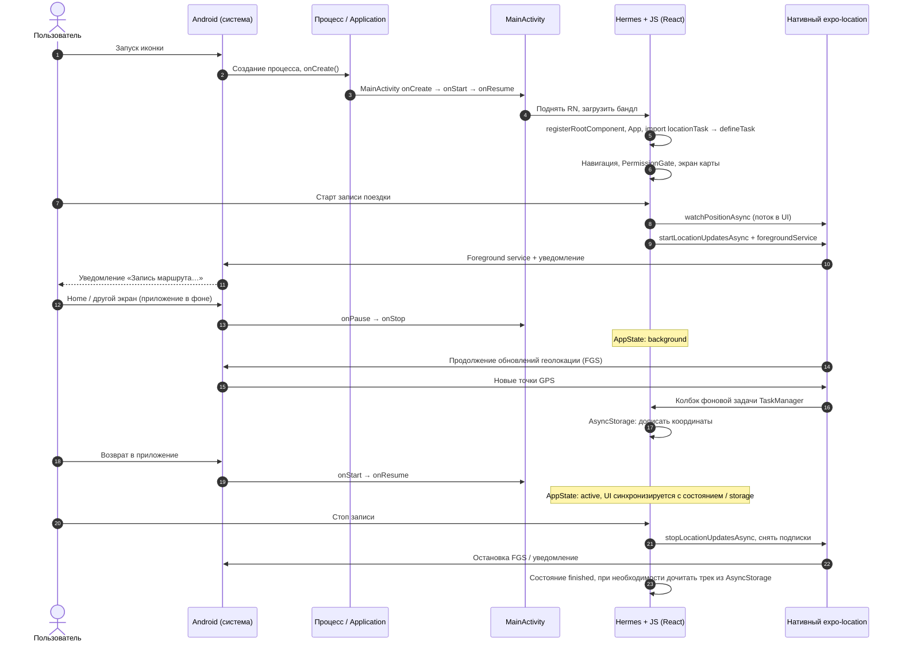
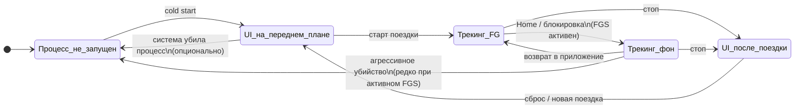

# Жизненный цикл приложения (временная диаграмма)

Упрощённая временная диаграмма: от холодного старта до трекинга и обратно. Не каждый внутренний вызов ОС, а **логический порядок** для стека Expo + React Native + Hermes + фоновая геолокация (`expo-location`, `expo-task-manager`).

---

## Последовательность (sequence)

---

## Состояния на оси времени

**Смысл:** жизненный цикл **процесса** и **Activity** пересекается с **сессией трекинга**: приложение может быть в фоне по Activity, но запись маршрута продолжается за счёт **foreground service** и колбэка фоновой задачи, пока пользователь не остановит трекинг.
